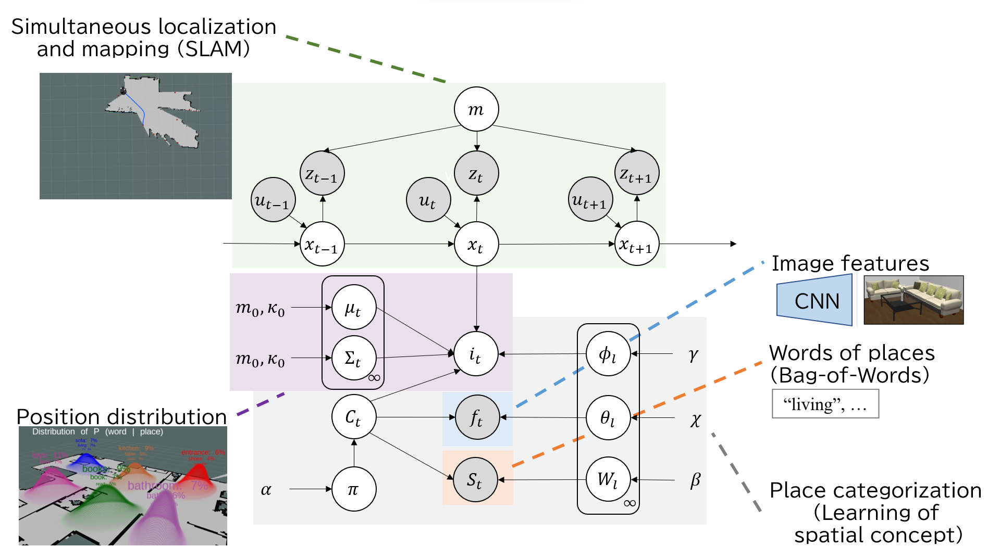

# Active-SpCoSLAM
Implementation of Active-SpCoSLAM that is the active semantic mapping method. 
This repository includes the source codes used for the experiments in our paper on SMC 2023. 

# Abstract of Active-SpCoSLAM
We proposed Active-SpCoSLAM, which simultaneously learns spatial concepts and maps based on information gain (IG).
IG is derived from the following graphical model: IG is calculated separately for IG related to simultaneous localization and mapping (SLAM), IG related to location concepts, and finally a weighted sum.
The mapping between language and location is then done using an image captioning model called ClipCap.

